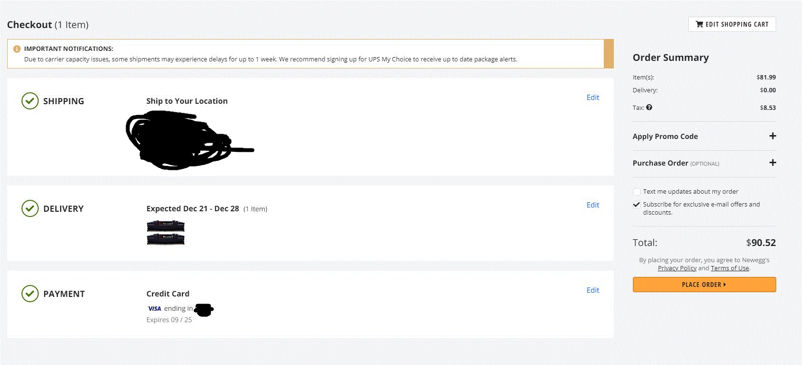

# NeweggBuyer
Autonomously buy GPUs from Newegg as soon as they become available. Forked from https://github.com/Ataraksia/NeweggBot

This bot is very much still in the early stages, and more than a little rough around the edges.  Expect the occasional hiccups if you decide to use it.

## Installation
You will require [Node.js 14](https://nodejs.org/en/) to run this. Check if Node is installed by typing this into your terminal:
```
node -v
npm -v
```
Make sure that the version number given after using "node -v" is greater than 14.

After installing this repository, via git or by downloading the code and extracting it, navigate to the folder where the files are located via powershell(or equivalent console) and run `npm install puppeteer -PUPPETEER_PRODUCT=firefox`.  If you end up experiencing the error `Error: Could not find browser revision latest` when running, you may also need to run the command `PUPPETEER-PRODUCT=firefox npm i puppeteer`.

## Configuration
Once that is finished, create a copy of config_template.json and name it config.json.  Inside you will find the very basic customization options.  
- `cv2` refers to the three digit code on the back of your credit card.  
- `refresh_time` refers to the duration to wait in seconds between add-to-cart attempts.  
- `item_number` refers to Newegg's item number found at the end of the card page URL.  For example, the item number for 'https://www.newegg.com/evga-geforce-rtx-3080-10g-p5-3897-kr/p/N82E16814487518' is N82E16814487518.  This bot can attempt to buy multiple card models at once by including multiple item numbers separated by a comma.  For example, 'N82E16814487518,N82E16814137598'. This bot will stop when the first available item in your list is added. Combo items work as well. The item number for this combo, https://www.newegg.com/Product/ComboDealDetails?ItemList=Combo.4206685, is Combo.4206685.
- `auto_submit` refers to whether or not you want the bot to complete the checkout process.  Setting it to 'true' will result in the bot completing the purchase, while 'false' will result in it completing all the steps up to but not including finalizing the purchase.  It is mostly intended as a means to test that the bot is working without actually having it buy something. The default value is false.

THE BOT WILL NOT AUTOMATICALLY BUY THE CARD. YOU MUST CHANGE THE AUTO_SUBMIT FIELD TO "true" IN config.json.
## Usage
After installation and configuration, the bot can then be run by using `node neweggbot.js`. 

It is important if you've never used your Newegg account before that you setup your account with a valid address and payment information, and then run through the checkout process manually making any changes to shipping and payment as Newegg requests.  You don't need to complete that purchase, just correct things so that when you click `Secure Checkout` from the cart, it brings you to `Review`, not `Shipping` or `Payment`. See image below:



At the moment, in the event that a card comes in stock, but goes out of stock before the bot has been able to complete the purchase, it will likely break, and you will need to restart it.  In general, there are very likely to be occasional issues that break the bot and require you to restart it.

## Common Problems
Sometimes the bot will get stuck at a certain stage of the buying process. Press Ctrl+C while in your terminal to stop the bot and proceed to complete the checkout manually. 
I recommend doing this if your in the middle of a buy and don't have time to troubleshoot.

The bot does not exit properly, you must close your terminal or stop the script with Ctrl+C after the bot completely finishes purchasing.